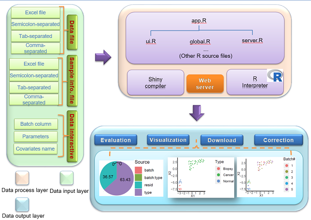

###  ***BatchSerer*** is a web server for batch effect evaluation, visualization and correction.

	
#### It's mainly based on following R packages:
> + `pvca`:  For batch effects evaluation
> + `umap`, `ggplot2`, `plotly`, :  For batch effects visualization
> + `sva`:  For batch effects correction (improved version)
> + `fitdistrplus`, `extraDistr`:  For goodness-of-fit test

#### Which is further wrapped by [`R/Shiny`]('http://shiny.rstudio.com/'). 

