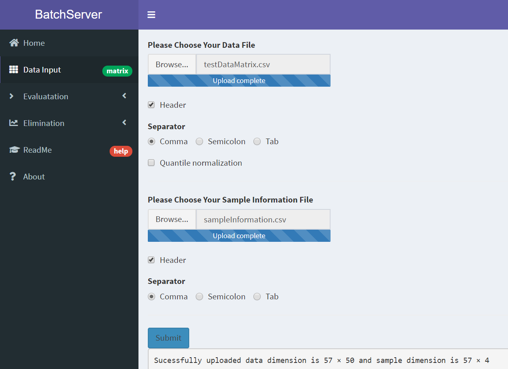
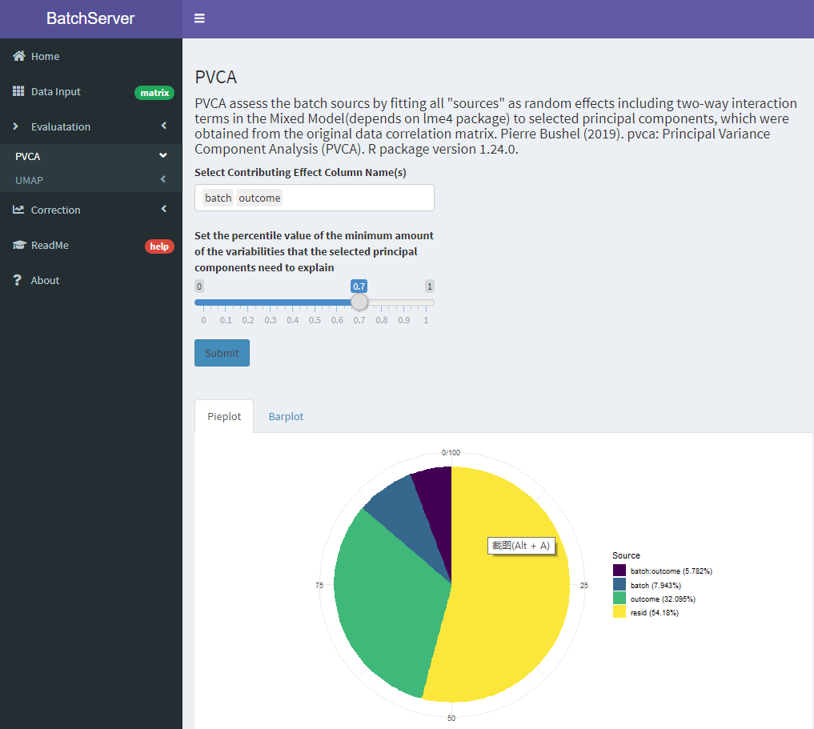
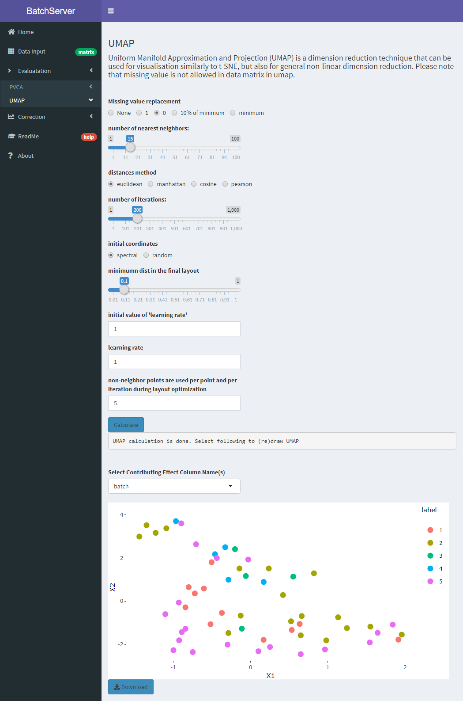
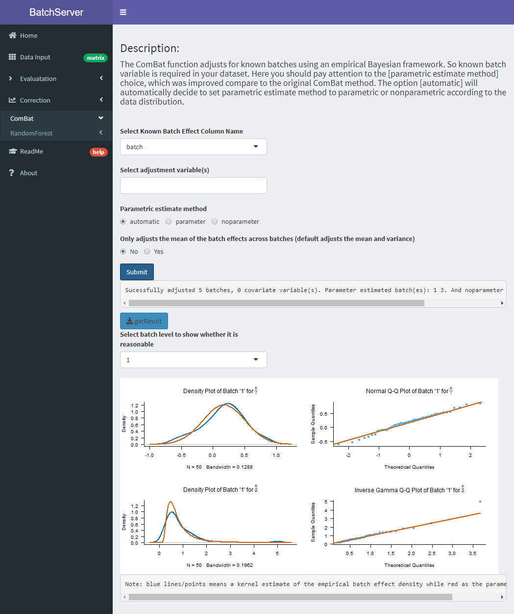

## Tutorial

### Data input
Users are required to prepare and upload two files: a data file and a sample information file. The format of these files can be tab-delimited, space-separated, comma-delimited or Excel file. BatchServer also provides test data files (see above section). Users can upload these two files in the `Data Input` menu, then click the `Submit` button. The data read module will read, process, and store the files for subsequent usage.

### Batch effect estimation, visualization and correction
After uploaded both data and sample information files. Users are advised to evaluate whether their data have batch effects using PVCA or UMAP equipped with the online server. Both methods can show the visualized results of batch effects. If the batch effect is heavy, the next step is to remove it using the improved ComBat.

### Data output
Users could examine and download the result figures of batch effect evaluation to evaluate the batch effects from the figures by manual inspection. The batch effect corrected data obtained by the improved ComBat is also provided for users to download.

### Example
Input page

The screenshot of using PVCA

The screenshot of using UMAP

Parameters settings and result of using improved ComBat

